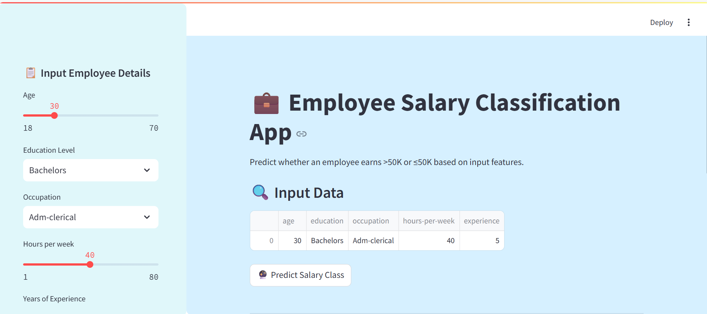
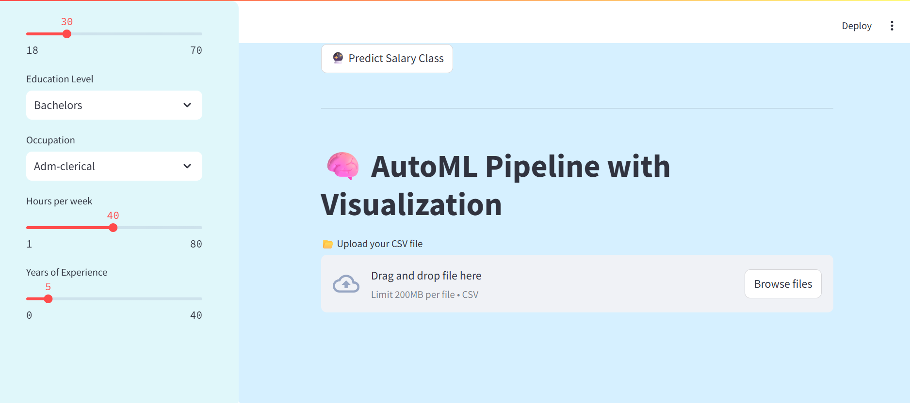
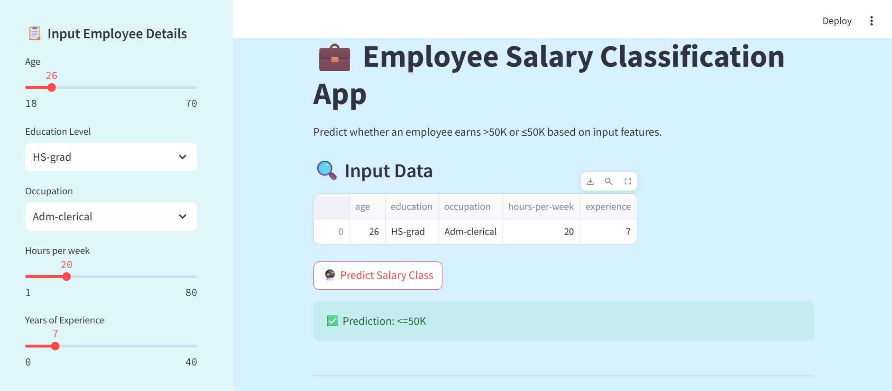
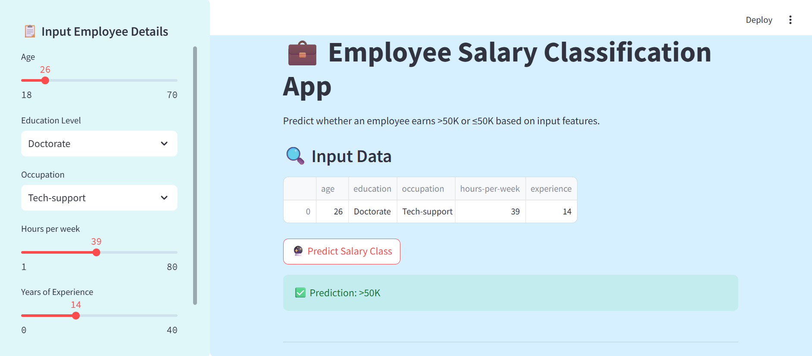
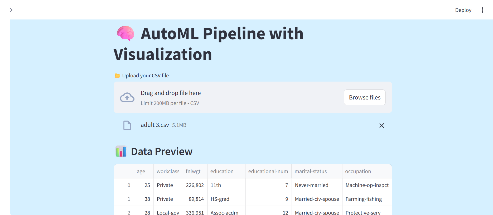
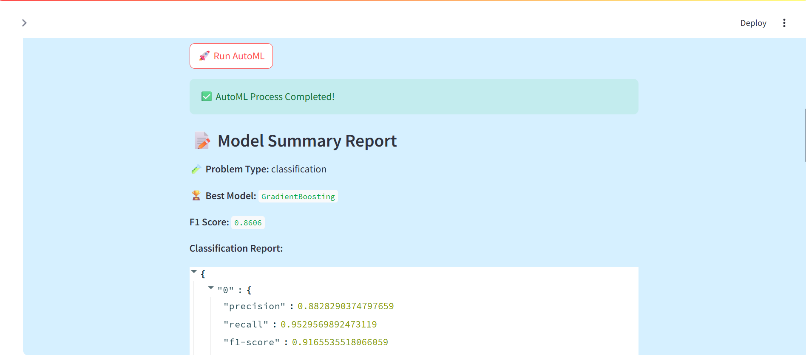
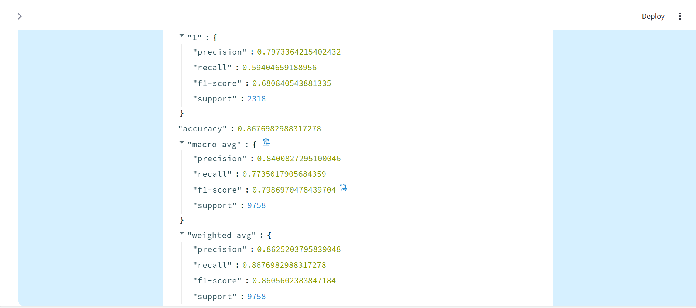
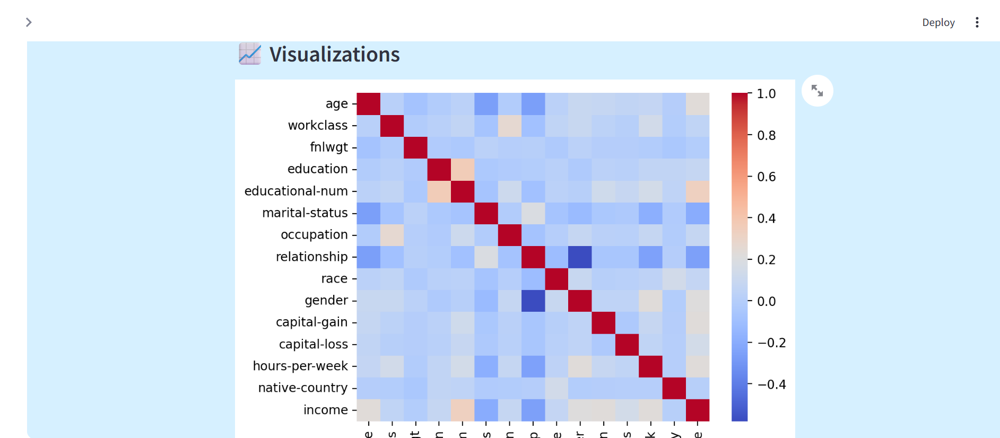
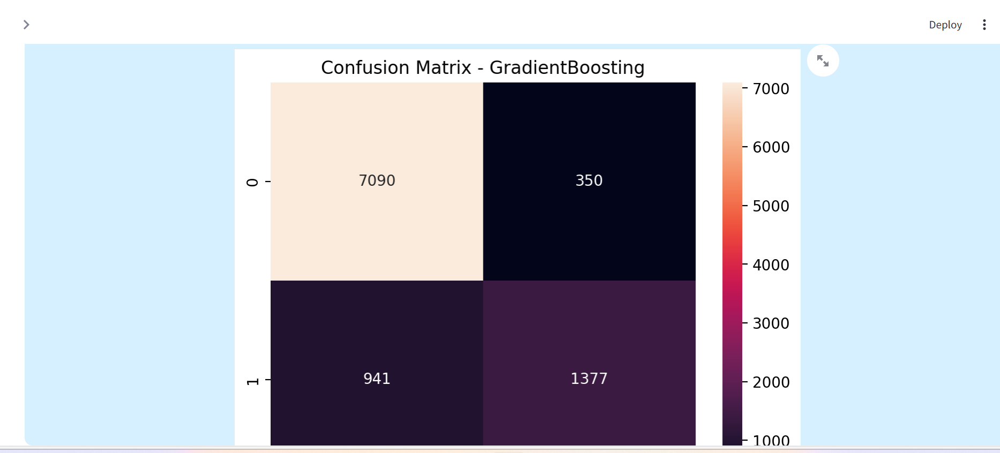

# Employee-Salary-Prediction-Using-Machine-Learning-Classification-Techniques
A machine learning project that predicts employee salaries using classification techniques such as Random Forest, Decision Tree, and Logistic Regression.

---

## 🚀 Features

- User-friendly Streamlit interface
- Predicts salary class based on user inputs
- Uses trained ML model (`best_model.pkl`)
- Preprocessing with encoders and scaler
- Visualizations using Seaborn and Matplotlib
- SMOTE for handling imbalanced datasets

---

## 🧠 Machine Learning Components

- `best_model.pkl`: Trained ML classification model
- `label_encoders.pkl`: Label encoders for categorical features
- `scaler.pkl`: Scaler object for feature normalization
- `feature_list.pkl`: List of selected features used for prediction
- `model_utils.py`: Contains ML pipeline and preprocessing logic

---

## 🗂️ Project Structure
- `employee-salary-prediction/
- `│
- `├── app.py
- `├── model_utils.py
- `├── pickle_files/
- `│   ├── best_model.pkl
- `│   ├── label_encoders.pkl
- `│   ├── scaler.pkl
- `│   └── feature_list.pkl
- `├── requirements.txt
- `├── README.md
- `├── .gitignore
- `├── APP Looks or Result of APP
- `│ ├── Employee_salary_prediction_final_output.png
- `│ ├── Employee_salary_prediction_final_output1.png	
- `│ ├── Employee_salary_prediction_final_output1.png	
- `│ ├── Employee_salary_prediction_final_output1.png	
- `│ ├── salary_prediction_less_than_50K.png
- `│ ├── salary_prediction_more_than_50K.png
- `│ ├── Auto_ML_Prediction_with_Dataset.png
- `│ ├── After_Run_Auto_ML.png
- `│ ├── After_Run_Auto_ML_1.png
- `│ ├──  Auto_ML_Visual.png
- `│ ├──  Auto_ML_Visual_1.png
- ` └── *.png   

---

## 💻 How to Run the App

1. **Clone the repository:**

   ```bash
   git clone https://github.com/YOUR_USERNAME/employee-salary-prediction.git
   cd employee-salary-prediction

pip install -r requirements.txt

streamlit run app.py

http://localhost:8501

---

## 🖼️ Demo Screenshots

### Final Outputs of APP

  
  

### Salary Predictions by Category

  
  

---

### Prediction with Dataset

  


### After Running Auto ML

  
  


### Auto ML Visualizations

  
  


